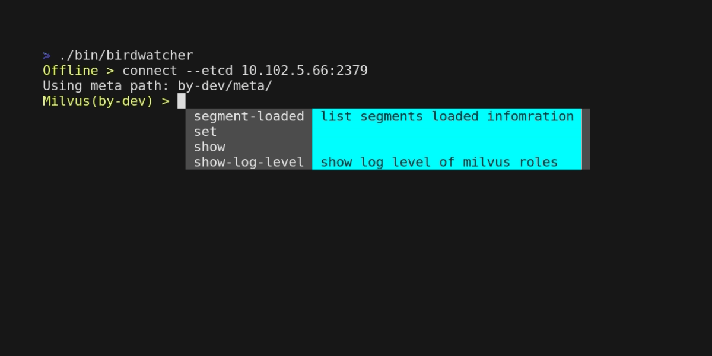

# Birdwatcher

[](https://github.com/milvus-io/birdwatcher/actions/workflows/golangci-lint.yml?query=branch%3Amain+)

Debug tool for Milvus 2.0 project. This tool connects to etcd and inspect some status of the Milvus system.

## Get Started

### Prerequisite
go 1.18 or higher 

### Install birdwatcher

install with go command
```shell
go install github.com/milvus-io/birdwatcher
```

or download source and run with go command
```shell
git clone https://github.com/milvus-io/birdwatcher
cd birdwatcher
go build -o birdwatcher main.go
```

## How to use

### connect to etcd 


```shell
❯ birdwatcher
# execute connect command, using default config, equal to connect --etcd localhost:2379 --rootPath by-dev
Offline: connect 
Using meta path: by-dev/meta/
✔ Milvus(by-dev): show collection
...
```

### connect to remote instance etcd with other basePath

```shell
❯ birdwatcher
Offline: connect --etcd [ip]:[port] --rootPath instanceName
Using meta path: instanceName/meta/
✔ Milvus(instanceName): 

```

### inspect some meta




```
Milvus(by-dev): show collections
================================================================================
Collection ID: 434393323906469185	Collection Name:gosdk_index_example
Partitions:
 - Partition ID:434393323906469186	Partition Name:_default
Fields:
 - Field ID: 0 	 Field Name: RowID 	 Field Type: Int64
 - Field ID: 1 	 Field Name: Timestamp 	 Field Type: Int64
 - Field ID: 100 	 Field Name: ID 	 Field Type: Int64
	 - Primary Key, AutoID: false
 - Field ID: 101 	 Field Name: Year 	 Field Type: Int32
 - Field ID: 102 	 Field Name: Vector 	 Field Type: FloatVector
	 - Type Param dim: 8
Consistency Level: Strong
✔ Milvus(by-dev): █
```

### backup etcd


```
Milvus(by-dev): backup
found 37 keys, at revision 533816, starting backup...
Backing up ... 100%(37/37)
backup etcd for prefix by-dev/meta done, stored in file: bw_etcd_ALL.220707-152246.bak.gz
```

### help

And use `help` command to check other commands.
